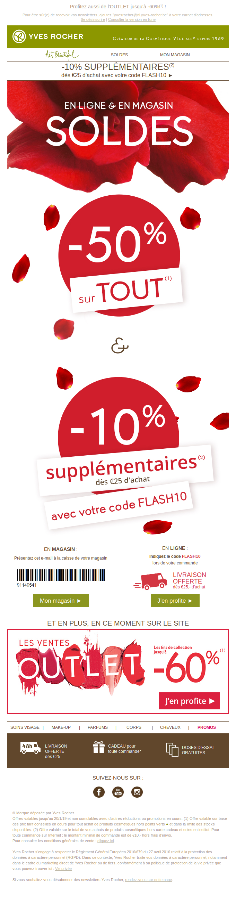

# Newsletter "YvesRocher"

- Repository GitHub : "NewsletterYvesRocher"
- Temps nécessaire : 2-3 jours
- Publier le résultat en tant que GitHub Page
- Remise du projet via ce [formulaire](https://goo.gl/forms/0ZuXfIK8Jl4Nkltm2)

## Objectifs pédagogiques
- utiliser les tableaux en HTML
- savoir reproduire une maquette
- respecter le style imposé (la charte graphique) par un client

## Charte graphique et éléments fournis

Le client vous fournit les [images et logos](/img), ainsi que le [texte](texte.md).
Il vous fait savoir que la police utilisée est Arial (une police Google). Si cette dernière ne fonctionne pas, par défaut, le navigateur doit afficher du sans-serif. Le client indique qu'il ne sait pas trop ce que ça veut dire mais leur graphiste leur a dit qu'en tant que developper, ces informations vous seront utiles.

## Maquette

